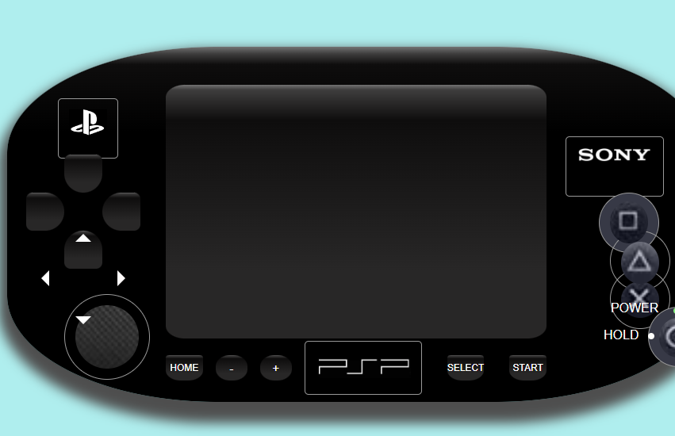

#PRIMER PROYECTO CON HTML
##PSP con HTML y CSS
Se ha realizado una videoconsola mediante estos procedimientos, para realizar este proyecto **ha sido fundamental** el uso de los "`div`" como base de toda la consola, ya que toda esta compuesta de "`div`" dentro de "`div`", es decir cajas dentro de cajas.

Para ello es **muy importante** el uso de los "`display:flex`" y todos sus variantes para ajsutar estos "`div`" dentro de otros. 

La **idea principal** era desarrollar la PSP, la cual, al pulsar un boton apareciera en la pantalla el video de introducción de la consola y su sonido correspondiente.

Para realizar todo esto se han utilizado las siguientes herramientas:

###Herramientas del desarrollo

Se ha usado fundamentalmente Visual Studio con sus extensiones pertinentes para un buen desarrollo del proyecto.

###Uso de la consola

Básicamente para que aparezca el video demos presionar el botón de "Start" que aparece en la imagen superior, una vez pulsado veremos apareces un video de introducción el con sonido de inicio.

Para desarrollar esta parte se ha debido implentar funciones de JavaScript, a continuación veremos como es el código de dicho video.

`function mostrarVideo(){`
        ``var video = document.getElementById("videoJuego");``
        ``video.style.display = "block";``
        ``video.currentTime = 0;``
      ``  video.play();``
        

  ` }`

  Como podemos ver en el código se coge el elemento mediante `document.getElementById("videoJuego")` el cual es "videoJuego" que está declarada en el HTML.

  Otra funcionalidad es que cuando el video se pausa, ya que dura unos 6 segundos aproximadamente, se ha añadido  ``video.currentTime = 0;`` que al pulsar de nuevo "START" comienza desde el principio.

  Otra funcionalidad era querer emular el parpadeo de encendido, aunque lamentablemente no como se quería, ya que se pretendía que una vez pulsado el botón "START" estas luces de "Power" y "Hold" parpadeasen, pero lo que sucede es que parpadean desde el inicio sin pulsar nada.

  Para que parpadeasen se ha añadido en el CSS el siguiente código:

  `#encendido{`

    background-color: grey;
    border-radius: 50%;
    width: 0.5em;
    height: 0.5em;

    margin-top: 1em;
    margin-left: 7em;

    animation: encendido 1s infinite;

`}` 

`@keyframes encendido {`
    
    0% {
        background-color: #16e204; /* color inicial */
      }
      50% {
        background-color: #ffffff; /* color intermedio */
      }
      100% {
        background-color: #09ff00; /* color final */
      }
`}`

En la parte de `#encendido` se encuentra la función de `animation` que indica la velocidad de parpadeo y además esta está asociada con `@keyframes` que están compuesta de tres colores para que de la sensación de parpadeo.

Se ha creado también una sensación de profundidad al pulsar los botones mediante el `hover` añadiendo menos anchura y una transición pequeña para conseguirlo, aquí dejamos un fragmento del código:

`#start:hover{`

    width: 3.3em;
    height: 1.8em;
    transition: 0.2s;

`}`

###Inconvenientes

Además algunos mencionados en el punto anterior, el principal problema ha sido que la consola no es responsive, no se ha conseguido implementar correctamente y en cierto momento que la página es demasiado pequeña se observa que se rompe el diseño. 

Ocurre sobre todo cuando se hace en horizontal, pero cuando se encoje en vertical no ocurre.

Agradecer a los compañeros que han ayudado en problemas y a nuestro profesor David por su disposición.

